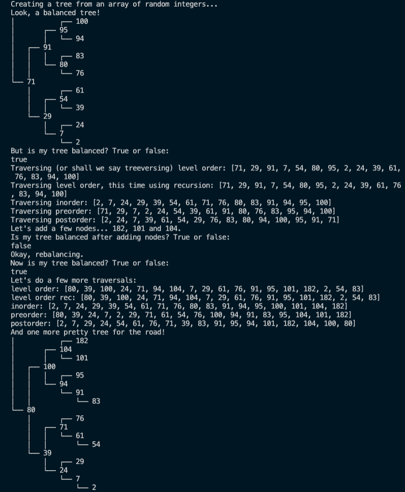

## Balanced Binary Search Tree

Ruby-based implementation of a balanced binary search tree, developed as part of The Odin Project's [Ruby on Rails Curriculum](http://www.theodinproject.com).

## Features
Methods include insertion, deletion, search, level order traversa and depth first traversals (inorder, preorder and postorder).

## Screenshot demo
